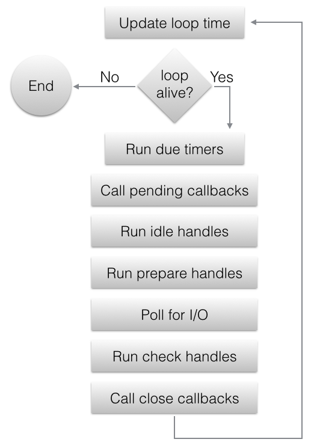

libuv是一个高性能的,事件驱动I/O的跨平台API集
------------------------

这一框架的关键是`异步`与`非阻塞`

整个框架的主题实际上就是一个循环,不断的重复执行某些过程

#### 事件
在这里,事件一般指的是以下几种:
- 一个socket已有数据,处于可读状态
- 一个计时器超时了

Note: 当在自己的程序中只使用一个事件循环的话,libuv提供了一个默认的事件循环(node.js就是如此)

### 句柄(Handle)与请求(Request)
#### 句柄(Handle)
事件的操作都是通过创建I/O设备,计时器,或者进程等句柄来进行的
- uv_loop_t 事件循环句柄
- uv_handle_t 所有句柄类型的基础类型
- uv_stream_t 双工通信通道的抽象句柄
- uv_tcp_t TCP句柄,uv_stream_t的子类
- uv_udp_t UDP句柄
- uv_pipe_t UNIX Domain Socket 或 Windows上命名管道的句柄,uv_stream_t的子类
- uv_tty_t 终端的stream句柄
- uv_poll_t 用于监视文件描述符的句柄
- uv_timer_t 定时任务(计时器)的句柄
- uv_prepare_t `Prepare`阶段句柄,该句柄对应的回调函数会在事件循环的每次循环迭代初执行一次,即在轮询I/O之前
- uv_check_t `Check`阶段句柄,该句柄对应的回调函数会在事件循环的每次循环迭代末执行一次,即在轮询I/O之后
- uv_idle_t 空转句柄,该句柄对应的回调函数会在事件循环的每次循环迭代初执行一次,比`Prepare`阶段还要早
- uv_async_t 异步句柄,允许用户从另一个非libuv维护的线程中唤醒libuv事件循环并执行该句柄对应的回调函数
- uv_process_t 子进程句柄
- uv_fs_event_t
- uv_fs_poll_t 文件系统监视句柄
- uv_signal_t 信号句柄

具体的句柄的执行顺序参考事件循环上的图或者[代码](https://github.com/libuv/libuv/blob/2c279504f92a7ab1fc54c85ec36272722198a77e/src/win/core.c#L506)

#### 请求(Request)
在libuv中,句柄是长生命周期的抽象概念,在一个句柄上有很多相关联的请求。
请求的生命周期更短(通常可被理解为一次性的),如对应句柄上的一次I/O操作
- uv_req_t — Base request
- uv_getaddrinfo_t 用于uv_getaddrinfo()
- uv_getnameinfo_t 用于uv_getnameinfo()
- uv_shutdown_t 用于uv_shutdown()
- uv_write_t 用于uv_write()等
- uv_connect_t 用于uv_listen()
- uv_udp_send_t 用于uv_udp_send()
- uv_fs_s 用于uv_fs_req_cleanup()等
- uv_work_t 用于uv_queue_work()

#### 回调函数
在libuv所关注的事件发生后,被调用的函数,事件发生后,业务代码应该在回调函数中实现.

-----------------------

使用`callback(回调)`机制来完成异步IO,通常带有参数`uv_stream_t`
或`uv_req_t`,这个数据表示这次回调绑定的数据

C语言没有原生的closure支持,如果有的话,closure应是callback机制的
最佳解决方案

所以在C语言中模拟闭包的方式是用一个C Function并携带一个`void *ud`
此`ud`即原本应该在闭包中绑定的数据块

TODO: 支持闭包的现代程序语言

在libuv中`uv_stream_t`大致等同于这个`ud`

